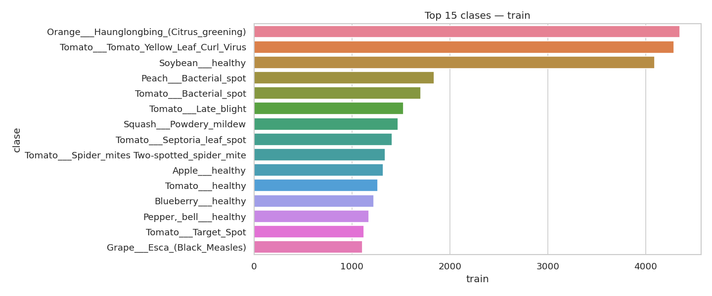
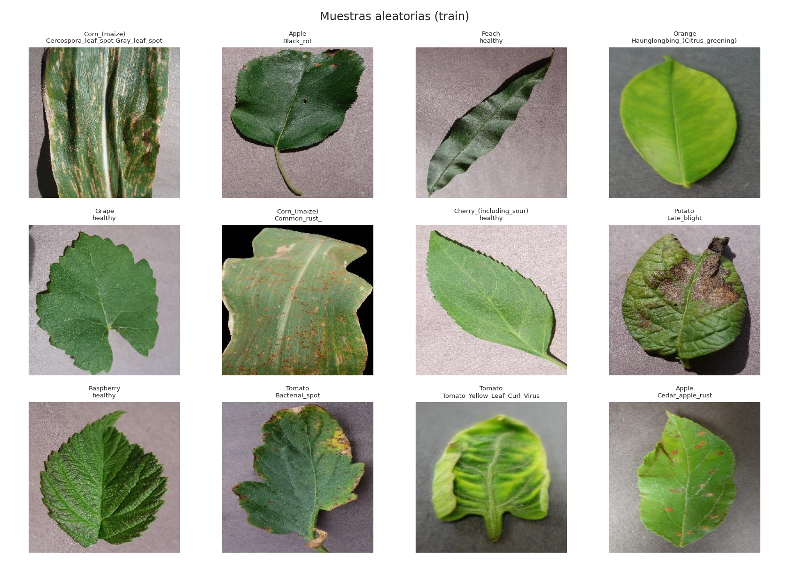
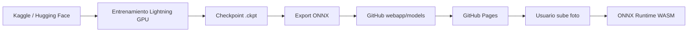
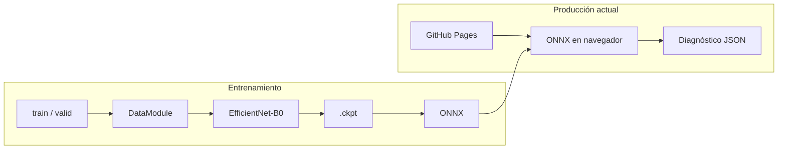

# Plant Disease Detector

<p align="center">
  <strong>Clasificación de enfermedades en hojas con Deep Learning + MLOps</strong><br/>
  Proyecto integrador · Maestría en Ciencia de Datos · EAFIT
</p>

<p align="center">
  
  
  
</p>

<p align="center">
  <a href="https://danielrpo1.github.io/plant-disease-detector/"><strong>Web demo</strong></a> ·
  <a href="#modelo-entrenado-y-resultados">Modelo y resultados</a> ·
  <a href="#limitaciones-de-uso">Limitaciones</a> ·
  <a href="#arquitectura">Arquitectura</a> ·
  <a href="#entrenamiento">Entrenar</a> ·
  <a href="notebooks/01_EDA_executed.ipynb">EDA</a>
</p>

---

## Equipo

| Integrante | GitHub |
|------------|--------|
| Daniel Restrepo | [@danielrpo1](https://github.com/danielrpo1) |
| E-DOR28 | [@E-DOR28](https://github.com/E-DOR28) |
| Eider Díaz | [@EiderDiaz-10](https://github.com/EiderDiaz-10) |
| Valentina Delgado | [@ValenDelgado](https://github.com/ValenDelgado) |

Repositorio: **https://github.com/danielrpo1/plant-disease-detector**

---

## El problema

Identificar **enfermedades en cultivos** a partir de fotos de hojas. El sistema clasifica entre **38 clases** (cultivo + enfermedad o “sano”) y expone el resultado en una **web** con diagnóstico, confianza, top-3 y recomendaciones de manejo orientativas.

## Demo

**URL:** [danielrpo1.github.io/plant-disease-detector](https://danielrpo1.github.io/plant-disease-detector/)

| Distribución de clases (EDA) | Muestras del dataset |
|:---:|:---:|
|  |  |

**Flujo:** subir foto → inferencia **ONNX en el navegador** → diagnóstico en español + avisos si la confianza es baja o la hoja no parece del dataset.

Ver [modelo entrenado](#modelo-entrenado-y-resultados) y [limitaciones](#limitaciones-de-uso).

---

## Proceso (pipeline)



| Etapa | Dónde | Qué ocurre |
|-------|--------|------------|
| Datos | Kaggle o Hugging Face | ~87k imágenes PlantVillage, 38 clases (`train/` + `valid/`) |
| Entrenamiento | Lightning AI Studio (GPU) | EfficientNet-B0, checkpoints, métricas |
| Artefacto | Repo `webapp/models/` | `model.onnx` (~16 MB) + metadatos de clases |
| Producción | GitHub Pages | La demo corre el modelo **en el cliente**; no requiere AWS |
| Opcional | `lambda/` + API Gateway | Misma red en ONNX vía servidor (ver [Despliegue](#despliegue)) |

---

## Arquitectura



| Capa | Tecnología |
|------|------------|
| Entrenamiento | PyTorch Lightning 2.x |
| Modelo | EfficientNet-B0 (pesos ImageNet) + cabeza 38 clases |
| Métricas | `train_loss`, `val_loss`, `train_acc`, `val_acc` |
| Inferencia | ONNX Runtime Web (WASM) |
| Frontend | HTML / CSS / JS estático |

**Por qué EfficientNet-B0 y no ResNet-50:** menor tamaño y latencia para ONNX en navegador, con buen rendimiento en PlantVillage; ResNet-50 es alternativa válida si la inferencia es solo en servidor.

---

## Dataset

- **Kaggle:** [New Plant Diseases Dataset](https://www.kaggle.com/datasets/vipoooool/new-plant-diseases-dataset)
- **Hugging Face:** [plantvillage-full](https://huggingface.co/datasets/geraldmc/plantvillage-full) (mismas 38 clases; usado en el entrenamiento de la demo)

| Métrica (EDA) | Valor |
|---------------|-------|
| Clases | 38 |
| Train | 43,356 |
| Valid | 10,948 |
| Desbalance max/min | ~36× |

Notebook con figuras: [`notebooks/01_EDA_executed.ipynb`](notebooks/01_EDA_executed.ipynb).

---

## Modelo entrenado y resultados

### Arquitectura y entrenamiento

| Aspecto | Detalle |
|---------|---------|
| Red | **EfficientNet-B0** + `Dropout(0.3)` + `Linear(1280 → 38)` |
| Preentrenamiento | ImageNet (`IMAGENET1K_V1`) |
| Aprendizaje | Transfer learning: 2 épocas backbone congelado → fine-tune completo |
| Optimizador | AdamW (cabeza `1e-3`, backbone `1e-4`) |
| Pérdida | Cross-entropy |
| Entrada | 224×224, normalización ImageNet |
| Mejor checkpoint | `efficientnet-epoch=08-val_acc=0.9628.ckpt` |
| Entorno | Lightning Studio, GPU NVIDIA L4 |
| Modo | `--fast` (50 img/clase en train, hasta 10 épocas) |

### Métricas

| Métrica | Significado |
|---------|-------------|
| **`val_acc`** | % de imágenes de **valid** donde la clase predicha coincide con la etiqueta. Es la métrica para guardar el mejor modelo. |
| **`val_loss`** | Error de clasificación en valid; debe bajar junto con `val_acc`. |
| **`train_acc` / `train_loss`** | Mismo criterio en entrenamiento; si train mejora mucho y valid no, hay sobreajuste. |

### Resultado principal

**`val_acc ≈ 96,3 %`** en el split de validación de PlantVillage (entrenamiento rápido con submuestreo).

- **Sí indica:** buen desempeño en fotos similares al dataset (14 cultivos, 38 estados, fondo tipo laboratorio).
- **No indica:** 96 % en cualquier hoja del mundo ni en condiciones de campo sin medir.

### Salida de la app

1. Diagnóstico principal (clase con mayor probabilidad softmax).
2. Confianza (% de esa probabilidad).
3. Top 3 alternativas.
4. Recomendación de manejo (`webapp/models/treatments.json`), omitida si el resultado parece poco confiable.

El modelo **siempre** elige una de las 38 clases; no hay etiqueta “desconocido”.

---

## Limitaciones de uso

### 14 cultivos, 38 clases

| Cultivo | Estados en el modelo |
|---------|----------------------|
| Manzana | Sarna, podredumbre negra, roya del cedro, sano |
| Arándano | Sano |
| Cereza | Oídio, sano |
| Maíz | Manchas, roya, tizón, sano |
| Uva | Podredumbre, esca, mancha foliar, sano |
| Naranja | Huanglongbing |
| Durazno | Mancha bacteriana, sano |
| Pimiento | Mancha bacteriana, sano |
| Papa | Tizón temprano/tardío, sano |
| Frambuesa / soja | Sano |
| Calabaza | Oídio |
| Fresa | Quemadura foliar, sano |
| Tomate | 9 enfermedades + sano |

No incluye mango, café, plátano, aguacate y muchos otros cultivos.

### Hojas fuera del dataset

El sistema asigna la clase **más parecida** entre 38. Puede fallar con confianza alta. La web avisa si confianza **&lt; 60 %** o si el top 3 mezcla cultivos distintos.

Traducciones: [`src/labels.py`](src/labels.py).

---

## Estructura del proyecto

```
plant-disease-detector/
├── src/                 # datamodule, model, train, export_onnx, labels, treatments
├── notebooks/           # EDA y figuras en eda_outputs/
├── webapp/              # Demo GitHub Pages + models/model.onnx
├── scripts/             # Descarga HF, API local, utilidades Lightning
├── lambda/              # Handler AWS opcional
└── infra/               # Scripts de despliegue AWS
```

---

## Entrenamiento

### Entorno local

```bash
git clone https://github.com/danielrpo1/plant-disease-detector.git
cd plant-disease-detector
python -m venv .venv && source .venv/bin/activate
pip install -r requirements.txt
```

### Datos

```bash
# Hugging Face (recomendado)
python scripts/download_dataset_hf.py --out data/plantvillage

# O Kaggle: carpeta con train/ y valid/
```

### Entrenar y exportar

```bash
# Subconjunto rápido (demo)
python -m src.train --data_dir data/plantvillage --fast

# Dataset completo
python -m src.train --data_dir data/plantvillage --epochs 15

python -m src.export_onnx \
  --checkpoint checkpoints/efficientnet-*.ckpt \
  --class_mapping checkpoints/class_mapping.json \
  --output webapp/models/model.onnx
```

**Lightning Studio:** credenciales en `.env` (ver `.env.example`), subida con `scripts/upload_to_lightning.py`, guía en [`notebooks/LIGHTNING_STUDIO.md`](notebooks/LIGHTNING_STUDIO.md).

---

## Despliegue

### Web (producción actual)

El workflow [`.github/workflows/deploy-pages.yml`](.github/workflows/deploy-pages.yml) publica `webapp/` en GitHub Pages. El modelo ONNX viaja en el repo; la inferencia es local en el navegador.

### API local (desarrollo)

```bash
pip install flask
python scripts/local_api.py \
  --onnx webapp/models/model.onnx \
  --meta webapp/models/model.meta.json
```

En `webapp/config.js`: `window.API_URL = "http://127.0.0.1:8000/predict"`.

### AWS (opcional)

Docker en `lambda/`, modelo en S3, API Gateway. Ver [`infra/deploy.sh`](infra/deploy.sh).

---

## Estado del proyecto

| Componente | Estado |
|------------|--------|
| EDA | ✅ [`01_EDA_executed.ipynb`](notebooks/01_EDA_executed.ipynb) |
| Entrenamiento EfficientNet-B0 | ✅ val_acc ≈ 96,3 % (`--fast`) |
| Export ONNX + web | ✅ [Demo en vivo](https://danielrpo1.github.io/plant-disease-detector/) |
| Tratamientos y avisos OOD en UI | ✅ |
| Entrenamiento full (~87k) | Pendiente |
| AWS Lambda en producción | Opcional |
| Informe / slides | En curso |

---

## Licencia

MIT — uso académico y educativo. El dataset tiene licencias propias en Kaggle / Hugging Face.

## Referencias

- [PlantVillage (Mohanty et al., 2016)](https://www.plantvillage.org/)
- [PyTorch Lightning](https://lightning.ai/docs/pytorch/stable/)
- [ONNX Runtime](https://onnxruntime.ai/)
- [EfficientNet (Tan & Le, 2019)](https://arxiv.org/abs/1905.11946)
