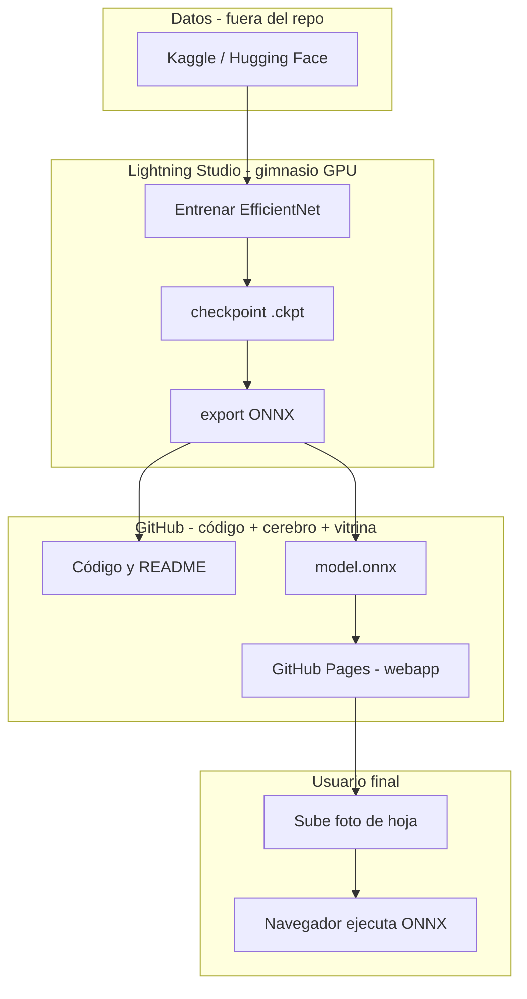
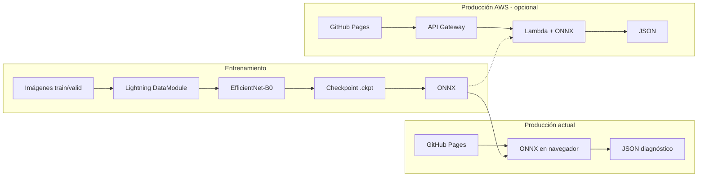

# Plant Disease Detector

<p align="center">
  <strong>Clasificación de enfermedades en hojas con Deep Learning + MLOps</strong><br/>
  Proyecto integrador · Maestría en Ciencia de Datos · EAFIT
</p>

<p align="center">
  
  
  
  
</p>

<p align="center">
  <a href="https://danielrpo1.github.io/plant-disease-detector/">Web demo</a> ·
  <a href="#roadmap">Qué sigue</a> ·
  <a href="#arquitectura">Arquitectura</a> ·
  <a href="#entrenamiento">Entrenar</a> ·
  <a href="notebooks/01_EDA_executed.ipynb">EDA</a>
</p>

---

## Equipo (EAFIT — Proyecto integrador)

| Integrante | GitHub |
|------------|--------|
| Daniel Restrepo | [@danielrpo1](https://github.com/danielrpo1) |
| E-DOR28 | [@E-DOR28](https://github.com/E-DOR28) |
| Eider Díaz | [@EiderDiaz-10](https://github.com/EiderDiaz-10) |
| Valentina Delgado | [@ValenDelgado](https://github.com/ValenDelgado) |

Repositorio del equipo: **https://github.com/danielrpo1/plant-disease-detector**

---

## El proceso explicado (con metáforas)

Imagina un **consultorio para plantas**:

| Metáfora | Qué es en la vida real | Dónde vive |
|----------|------------------------|------------|
| **Biblioteca de casos** (fotos de hojas enfermas y sanas) | Dataset (~38 enfermedades × miles de fotos) | Kaggle / Hugging Face — **no** en Lightning ni en GitHub (son demasiadas imágenes) |
| **Gimnasio / universidad** donde el médico **estudia** | Entrenamiento con GPU (épocas, loss, accuracy) | **Lightning AI Studio** — un PC en la nube con GPU que alquilas por horas |
| **Apuntes y código del curso** | Scripts Python, notebooks, README | **GitHub** — como un Google Drive público para programadores |
| **El cerebro entrenado** (conocimiento ya aprendido) | Archivo del modelo: primero `.ckpt`, luego `.onnx` | Tras entrenar: en Lightning un rato → luego copiado a **GitHub** (`webapp/models/`) |
| **Consultorio en la calle** (donde llega el paciente) | Página web donde subes una foto | **GitHub Pages** — hosting gratis de la carpeta `webapp/` |
| **Recepcionista en la nube** (opcional, brief AWS) | API Lambda que recibe la foto y responde JSON | **AWS** — solo si montan servidor; hoy la demo usa el cerebro **en el navegador** |

### ¿Qué vive en Lightning y qué no?

**En Lightning vive temporalmente:**

- El dataset **mientras entrenas** (carpeta `data/plantvillage/` en el disco del Studio).
- El **entrenamiento en vivo** (GPU calculando pesos).
- Los **checkpoints** `.ckpt` antes de exportar.

**No vive permanentemente en Lightning:**

- La web pública (cuando apagas el Studio, la web sigue en GitHub Pages).
- El “cerebro” final para usuarios (se **exporta** y se lleva a GitHub).

Lightning es el **gimnasio**, no el **hospital definitivo**.

### ¿Dónde vive el cerebro?

```
1. Durante el estudio  →  Lightning (archivo .ckpt en el Studio)
2. Para viajar ligero  →  se convierte a ONNX (~16 MB) — “cerebro comprimido”
3. Para la demo web    →  GitHub (webapp/models/model.onnx)
4. En tu celular/PC    →  el navegador descarga ese ONNX y piensa localmente
5. (Opcional AWS)      →  S3 + Lambda tendrían otra copia del mismo ONNX
```

El **cerebro no es Lightning**. Lightning solo **lo creó**.  
El cerebro **publicado** está en **GitHub** (y se ejecuta en el **navegador** del usuario o, si lo configuran, en **AWS Lambda**).

### ¿Para qué usamos GitHub?

GitHub cumple **cuatro roles** distintos:

1. **Caja fuerte del código** — `src/`, notebooks, scripts: todo el equipo clona, edita y hace `git push`.
2. **Memoria del proyecto** — este README, EDA con figuras, instrucciones (`DESPUES_DEL_EDA.md`).
3. **Museo del modelo** — `model.onnx` + nombres de las 38 clases para que la web funcione sin depender de Lightning.
4. **Escaparate (GitHub Pages)** — la URL pública del consultorio: [danielrpo1.github.io/plant-disease-detector](https://danielrpo1.github.io/plant-disease-detector/)

Sin GitHub tendrías código solo en tu laptop y el profesor no podría ver ni repetir el experimento.

### Flujo completo en una frase

> Fotos en internet → se **entrenan** en Lightning → el cerebro se **guarda** en GitHub → la **web** en Pages usa ese cerebro para diagnosticar hojas.



### Demo actual vs. diseño con AWS (brief)

| Modo | Cómo funciona |
|------|----------------|
| **Hoy (listo)** | Pages descarga el ONNX desde GitHub; el diagnóstico ocurre en **tu navegador**. |
| **Brief completo (opcional)** | Pages envía la foto a **API Gateway → Lambda**; el cerebro corre en AWS y devuelve JSON. |

Ambos usan el **mismo cerebro** (mismo archivo ONNX); solo cambia **dónde piensa** (navegador vs. nube AWS).

---

## El problema

Los agricultores y agrónomos necesitan identificar **enfermedades en cultivos** a partir de fotos de hojas. Este proyecto entrena un clasificador de **38 clases** (planta + enfermedad o “sano”) y lo expone mediante una **API ligera** y una **web** donde se sube una imagen y se obtiene el diagnóstico con confianza.

## Demo

| EDA — distribución de clases | Muestras del dataset |
|:---:|:---:|
|  |  |

**Flujo de usuario:** subir foto → modelo ONNX (en el navegador o en AWS) → top-3 predicciones en español.

```json
{
  "predictions": [
    {"class": "Tomato___Late_blight", "confidence": 0.92, "display_name": "Tomate - Tizón tardío"}
  ],
  "top_prediction": "Tomato___Late_blight",
  "confidence": 0.92
}
```

## Arquitectura



| Capa | Tecnología | Por qué |
|------|------------|---------|
| Entrenamiento | PyTorch Lightning 2.x | Loop reproducible, checkpoints, mixed precision |
| Modelo | EfficientNet-B0 (ImageNet) | Mejor que VGG para deploy; transfer learning |
| Logging | W&B / TensorBoard | Curvas para informe académico |
| Inferencia | ONNX Runtime en Lambda | ~50 MB vs ~800 MB de PyTorch |
| Frontend | HTML/CSS/JS estático | GitHub Pages sin backend propio |

## Dataset

- **Kaggle:** [New Plant Diseases Dataset](https://www.kaggle.com/datasets/vipoooool/new-plant-diseases-dataset) (~87k imágenes, `train/` + `valid/`)
- **Alternativa (EDA / export):** [plantvillage-full en Hugging Face](https://huggingface.co/datasets/geraldmc/plantvillage-full) — mismas **38 clases**

### Resumen EDA (ejecutado en el repo)

| Métrica | Valor |
|---------|-------|
| Clases | 38 |
| Train | 43,356 |
| Valid | 10,948 |
| Desbalance max/min | ~36× |

Ver notebook con outputs: [`notebooks/01_EDA_executed.ipynb`](notebooks/01_EDA_executed.ipynb).

## Estructura del proyecto

```
plant-disease-detector/
├── src/
│   ├── datamodule.py      # LightningDataModule + augmentations
│   ├── model.py           # EfficientNet + freeze / fine-tune
│   ├── train.py           # CLI de entrenamiento
│   └── export_onnx.py     # Export para Lambda
├── notebooks/
│   ├── 01_EDA.ipynb
│   └── eda_outputs/       # Figuras del informe
├── lambda/                # Handler AWS (Docker + ONNX)
├── webapp/                # UI para GitHub Pages
├── scripts/               # API local, upload Lightning, download HF
└── infra/                 # Deploy AWS (esqueleto)
```

El código en `src/` está **comentado en español** (bloques explicando qué hace Lightning y por qué).

## Entrenamiento

### 1. Entorno

```bash
git clone https://github.com/danielrpo1/plant-disease-detector.git
cd plant-disease-detector
python -m venv .venv && source .venv/bin/activate
pip install -r requirements.txt
```

### 2. Datos

**Opción A — Kaggle:** descarga y apunta a la carpeta con `train/` y `valid/`.

**Opción B — Hugging Face:**

```bash
python scripts/download_dataset_hf.py --out data/plantvillage
# Prueba rápida: --max-per-class 100
```

### 3. Entrenar

```bash
# Modo rápido (~1–2 h GPU): 50 img/clase, 10 épocas
python -m src.train --data_dir data/plantvillage --fast

# Modo completo
python -m src.train --data_dir data/plantvillage --epochs 15
```

### 4. Exportar ONNX

```bash
python -m src.export_onnx \
  --checkpoint checkpoints/efficientnet-*.ckpt \
  --class_mapping checkpoints/class_mapping.json \
  --output artifacts/model.onnx
```

### Lightning AI Studio

```bash
cp .env.example .env   # LIGHTNING_USER_ID + LIGHTNING_API_KEY
./scripts/lightning_login.sh
# Sube el repo al Studio y entrena (ver notebooks/LIGHTNING_STUDIO.md)
```

## Despliegue

### Plan A — AWS (producción)

1. Sube `artifacts/model.onnx` + `model.meta.json` a **S3**.
2. Build imagen Docker en `lambda/` y despliega en **Lambda**.
3. Crea **API Gateway** (POST, CORS abierto para demo).
4. Pon la URL en `webapp/config.js` y publica **GitHub Pages**.

Detalle: [`infra/deploy.sh`](infra/deploy.sh) y [`PLAN_1_DIA.md`](PLAN_1_DIA.md).

### Plan B — Demo local (sin AWS)

```bash
pip install flask
python scripts/local_api.py \
  --onnx artifacts/model.onnx \
  --meta artifacts/model.meta.json
```

En `webapp/config.js`: `window.API_URL = "http://127.0.0.1:8000/predict"`.

## Roadmap

| Paso | Estado | Entregable |
|------|--------|------------|
| 1. EDA | ✅ | [`01_EDA_executed.ipynb`](notebooks/01_EDA_executed.ipynb) |
| 2. Entrenar EfficientNet | ✅ | val_acc ≈ **96.3%** (`--fast`, 50 img/clase) |
| 3. Export ONNX | ✅ | `webapp/models/model.onnx` (16 MB) |
| 4. Inferencia en web | ✅ | ONNX en el navegador (sin AWS) |
| 5. GitHub Pages | ✅ | [danielrpo1.github.io/plant-disease-detector](https://danielrpo1.github.io/plant-disease-detector/) |
| 6. Informe / slides | ⏳ | Pipeline end-to-end |

## Qué sigue después del EDA

Ver guía detallada: [`DESPUES_DEL_EDA.md`](DESPUES_DEL_EDA.md).

Resumen en 4 pasos:

1. **Entrenar** en Lightning Studio → `python -m src.train --data_dir ... --fast`
2. **Exportar** → `python -m src.export_onnx --checkpoint ...`
3. **API** → Lambda + API Gateway *o* `scripts/local_api.py` para la demo
4. **Conectar la web** → pegar la URL de la API en `webapp/config.js` (la Pages ya está publicada)

## Licencia

MIT — uso académico y educativo. El dataset tiene sus propias licencias en Kaggle / Hugging Face.

## Referencias

- [PlantVillage (Mohanty et al., 2016)](https://www.plantvillage.org/)
- [PyTorch Lightning Docs](https://lightning.ai/docs/pytorch/stable/)
- [ONNX Runtime](https://onnxruntime.ai/)
