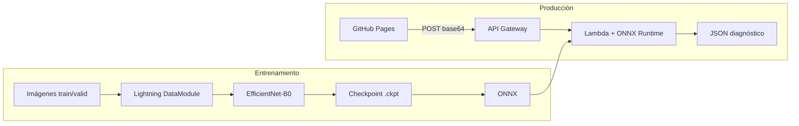

# Plant Disease Detector

<p align="center">
  <strong>Clasificación de enfermedades en hojas con Deep Learning + MLOps</strong><br/>
  Proyecto integrador · Maestría en Ciencia de Datos · EAFIT
</p>

<p align="center">
  
  
  
  
</p>

<p align="center">
  <a href="#demo">Demo</a> ·
  <a href="#arquitectura">Arquitectura</a> ·
  <a href="#dataset">Dataset</a> ·
  <a href="#entrenamiento">Entrenar</a> ·
  <a href="#despliegue">Desplegar</a> ·
  <a href="notebooks/01_EDA_executed.ipynb">EDA</a>
</p>

---

## El problema

Los agricultores y agrónomos necesitan identificar **enfermedades en cultivos** a partir de fotos de hojas. Este proyecto entrena un clasificador de **38 clases** (planta + enfermedad o “sano”) y lo expone mediante una **API ligera** y una **web** donde se sube una imagen y se obtiene el diagnóstico con confianza.

## Demo

| EDA — distribución de clases | Muestras del dataset |
|:---:|:---:|
|  |  |

**Flujo de usuario:** subir foto → API (ONNX) → top-3 predicciones en español.

```json
{
  "predictions": [
    {"class": "Tomato___Late_blight", "confidence": 0.92, "display_name": "Tomate - Tizón tardío"}
  ],
  "top_prediction": "Tomato___Late_blight",
  "confidence": 0.92
}
```

## Arquitectura



| Capa | Tecnología | Por qué |
|------|------------|---------|
| Entrenamiento | PyTorch Lightning 2.x | Loop reproducible, checkpoints, mixed precision |
| Modelo | EfficientNet-B0 (ImageNet) | Mejor que VGG para deploy; transfer learning |
| Logging | W&B / TensorBoard | Curvas para informe académico |
| Inferencia | ONNX Runtime en Lambda | ~50 MB vs ~800 MB de PyTorch |
| Frontend | HTML/CSS/JS estático | GitHub Pages sin backend propio |

## Dataset

- **Kaggle:** [New Plant Diseases Dataset](https://www.kaggle.com/datasets/vipoooool/new-plant-diseases-dataset) (~87k imágenes, `train/` + `valid/`)
- **Alternativa (EDA / export):** [plantvillage-full en Hugging Face](https://huggingface.co/datasets/geraldmc/plantvillage-full) — mismas **38 clases**

### Resumen EDA (ejecutado en el repo)

| Métrica | Valor |
|---------|-------|
| Clases | 38 |
| Train | 43,356 |
| Valid | 10,948 |
| Desbalance max/min | ~36× |

Ver notebook con outputs: [`notebooks/01_EDA_executed.ipynb`](notebooks/01_EDA_executed.ipynb).

## Estructura del proyecto

```
plant-disease-detector/
├── src/
│   ├── datamodule.py      # LightningDataModule + augmentations
│   ├── model.py           # EfficientNet + freeze / fine-tune
│   ├── train.py           # CLI de entrenamiento
│   └── export_onnx.py     # Export para Lambda
├── notebooks/
│   ├── 01_EDA.ipynb
│   └── eda_outputs/       # Figuras del informe
├── lambda/                # Handler AWS (Docker + ONNX)
├── webapp/                # UI para GitHub Pages
├── scripts/               # API local, upload Lightning, download HF
└── infra/                 # Deploy AWS (esqueleto)
```

El código en `src/` está **comentado en español** (bloques explicando qué hace Lightning y por qué).

## Entrenamiento

### 1. Entorno

```bash
git clone https://github.com/danielrpo1/plant-disease-detector.git
cd plant-disease-detector
python -m venv .venv && source .venv/bin/activate
pip install -r requirements.txt
```

### 2. Datos

**Opción A — Kaggle:** descarga y apunta a la carpeta con `train/` y `valid/`.

**Opción B — Hugging Face:**

```bash
python scripts/download_dataset_hf.py --out data/plantvillage
# Prueba rápida: --max-per-class 100
```

### 3. Entrenar

```bash
# Modo rápido (~1–2 h GPU): 50 img/clase, 10 épocas
python -m src.train --data_dir data/plantvillage --fast

# Modo completo
python -m src.train --data_dir data/plantvillage --epochs 15
```

### 4. Exportar ONNX

```bash
python -m src.export_onnx \
  --checkpoint checkpoints/efficientnet-*.ckpt \
  --class_mapping checkpoints/class_mapping.json \
  --output artifacts/model.onnx
```

### Lightning AI Studio

```bash
cp .env.example .env   # LIGHTNING_USER_ID + LIGHTNING_API_KEY
./scripts/lightning_login.sh
# Sube el repo al Studio y entrena (ver notebooks/LIGHTNING_STUDIO.md)
```

## Despliegue

### Plan A — AWS (producción)

1. Sube `artifacts/model.onnx` + `model.meta.json` a **S3**.
2. Build imagen Docker en `lambda/` y despliega en **Lambda**.
3. Crea **API Gateway** (POST, CORS abierto para demo).
4. Pon la URL en `webapp/config.js` y publica **GitHub Pages**.

Detalle: [`infra/deploy.sh`](infra/deploy.sh) y [`PLAN_1_DIA.md`](PLAN_1_DIA.md).

### Plan B — Demo local (sin AWS)

```bash
pip install flask
python scripts/local_api.py \
  --onnx artifacts/model.onnx \
  --meta artifacts/model.meta.json
```

En `webapp/config.js`: `window.API_URL = "http://127.0.0.1:8000/predict"`.

## Roadmap

- [x] EDA + código Lightning comentado
- [x] Export ONNX + handler Lambda
- [x] Webapp estática
- [ ] Entrenamiento full 87k + métricas en W&B
- [ ] CI/CD GitHub Actions → AWS
- [ ] GitHub Pages en producción

## Autor

**Daniel Restrepo** — Maestría en Ciencia de Datos, EAFIT  
GitHub: [@danielrpo1](https://github.com/danielrpo1)

## Licencia

MIT — uso académico y educativo. El dataset tiene sus propias licencias en Kaggle / Hugging Face.

## Referencias

- [PlantVillage (Mohanty et al., 2016)](https://www.plantvillage.org/)
- [PyTorch Lightning Docs](https://lightning.ai/docs/pytorch/stable/)
- [ONNX Runtime](https://onnxruntime.ai/)
